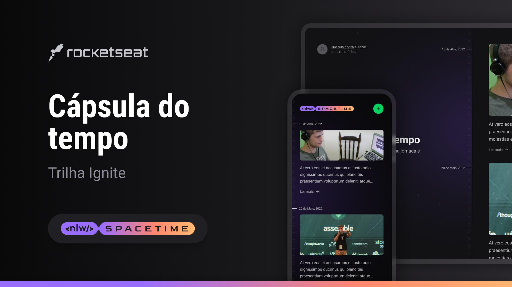

<div align="center">
   
   <br/><br/>
   <div align="center">
   
   
   
   
   
   
   <a href="https://github.com/ErickSilva2605/rocketseat-nlw-spacetime/commits/main">
      
   </a>
   <a href="https://github.com/ErickSilva2605/rocketseat-nlw-spacetime/issues">
      
   <a/>
   <a href="https://github.com/ErickSilva2605/rocketseat-nlw-spacetime/pulls">
      
   </a>
      <a href="https://github.com/ErickSilva2605/rocketseat-nlw-spacetime/blob/main/LICENSE">
      
   </a>
</div>
<br/><br/>
   <h1 align="center">[NLW Spacetime] Mission: Ignite</h1>
</div>

<h2 align="center">Tópicos 📋</h2>

   <p>

- [Sobre 📖](#sobre-)
- [Layout 🎨](#layout-)
- [Tecnologias 🛠️](#Tecnologias-)
- [Arquivos no Notion 📋](#arquivo-no-notion-)
- [Primeiros Passos 🚀](#primeiros-passos-)
- [Como Contribuir 💪](#como-contribuir-)
- [Licença 📝](#licença-)

   </p>

---

<h2 align="center">Sobre 📖</h2>
<p align="center">
   Esse projeto foi desenvolvido na Next Level Week Spacetime, em uma semana intensa de estudos, acompanhado de um projeto desenvolvido pela Rocketseat do dia 15 ao dia 23 de Maio de 2023.<br>
   Essa aplicação consiste em um sistema Web e Mobile com temática de cápsula do tempo, que permitirá os usuários registrarem momentos importantes e compartilhá-los com seus amigos.
   <br/>
</p>

---

<h2 align="center">Layout 🎨</h2>

   <p align="center">
      
   </p>

   <p align="center">
      O Layout desenvolvido por <a href="https://www.figma.com/@rocketseat">Rocketseat</a>, para acessar no Figma:

- <a href="https://www.figma.com/community/file/1240070456276424762">Missão Ignite</a> 🚀

   </p>

---

<h2 align="center">Tecnologias 🛠️</h2>

   <p>

- [NodeJS](https://nodejs.org/)
- [ReactJS](https://reactjs.org/)
- [TypeScript](https://www.typescriptlang.org)
- [TailWindCSS](https://tailwindcss.com)
- [React native](https://reactnative.dev/)
- [Expo](https://expo.dev/)
- [Prisma](https://www.prisma.io)
- [Fastify](https://www.fastify.io)

   </p>

---

<h2 align="center">Arquivo no Notion 📋</h2>

- [Missão Ignite](https://efficient-sloth-d85.notion.site/Trilha-Ignite-e2ed19139b544a46984a28b65dcd4aae) 🚀

---

<h2 align="center">Primeiros Passos 🚀</h2>

   ```
   - Clone o projeto 

   $ git clone https://github.com/ErickSilva2605/rocketseat-nlw-spacetime.git
   $ cd rocketseat-nlw-spacetime
   ```

### Web

   ```
   # Instalar as dependências
   $ cd web
   $ npm install

   # Inicia o projeto
   $ npm start
   ```

### Server

   ```
   # Instalar as dependências
   $ cd server
   $ npm install

   # Inicia o projeto
   $ npx prisma migrate deploy
   $ npm run dev
   ```

### Mobile

   ```
   # Instalar as dependências
   $ cd mobile
   $ npm install

   # Inicia o projeto
   $ npx expo start
   ```

---

<h2 align="center">Como Contribuir 💪</h2>

   ```
   - Clone o projeto 

   - Cria uma nova branch com suas mudanças:
   $ git checkout -b my-feature

   - Salve suas mudanças e crie uma mensagem de commit falando o que fez:
   $ git commit -m "feature: My new feature"

   - Envie suas mudanças:
   $ git push origin my-feature
   ```

---

<h2 align="center">Licença 📝</h2>

<p align="center">
   Este repositório está sob licença MIT. Você pode ver o arquivo <a href="https://github.com/ErickSilva2605/rocketseat-nlw-spacetime/blob/main/LICENSE">LICENSE</a> para mais detalhes.
</p><br>

---

   >Esse projeto foi desenvolvido por **[@Erick Augusto](https://www.linkedin.com/in/erick-augusto-silva/)**, com os instrutores da **[Rocketseat](https://rocketseat.com.br/)**, na #NextLevelWeekSpacetime.<br>
   Se isso te ajudou, dê uma ⭐, isso vai me ajudar também! 😉

---

<br>
<div align="center">

   [](https://www.linkedin.com/in/erick-augusto-silva/)

</div>
